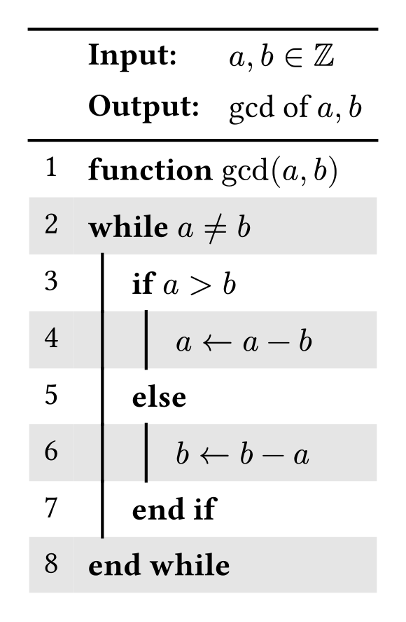

# ez-algo

A package to set algorithms in typst with ease.
It indents and dedents the lines based on some simple keywords, which you can cahnge if you like to.


<table><tr>
  <td>
      
  </td>
  <td>

```typst
#ez-algo(
  input: [$a,b in ZZ$],
  output: [gcd of $a,b$],
)[
  *function* $"gcd"(a,b)$ \
  *while* $a != b$ \
  *if* $a>b$\
        $a <- a - b$ \
  *else* \
        $b <- b - a$ \
  *end if* \
  *end while*
]
``` 
</tr>
</table>

```typst
#let ez-algo(body,
               input: none,
              output: none,
                fill: (x, y) =>  if calc.even(y) {gray.lighten(70%)},
          head_color: none,
              stroke: none,
     indent_keywords: ([while], [if], [for]),
     dedent_keywords: ([end while], [end if]),
      other_keywords: ([else], [else if], [end for]),
              indent: true,
               inset: 5pt,
       content_color: (numbers: black, stroke: 1pt +black, lines: black),
```

## ez-algo

**input**: ```string``` or ```array``` sets the input in der heading of the algorithm. To change the keyword input set an array.
Default: ```none```

**output**: ```string``` or ```array``` sets the output in der heading of the algorithm. To change the keyword input set an array.
Default: ```none```

**fill:** ```string``` or ```array``` sets the input in der heading of the algorithm. To change the keyword input set an array.
Default: 
```typst
(x, y) =>  if calc.even(y) {gray.lighten(70%)}
```

**head_color:** 
Default: ```none```

**stroke:** ```none``` or ```length``` or ```color``` or ```gradient``` or ```array``` or ```stroke``` or ```pattern``` or ```dictionary``` or ```function```,
Default: ```none```

**indent_keywords:** ```array```
Default: 
([while], [if], [for])

**dedent_keywords:** ```array```
([end while], [end if])

**other_keywords:** ```array```

([else], [else if], [end for])

**indent:** ```bool```
Defaut: true

**inset:** 5pt

**content_color:** ```dictionary```
(numbers: black, stroke: 1pt +black, lines: black),

